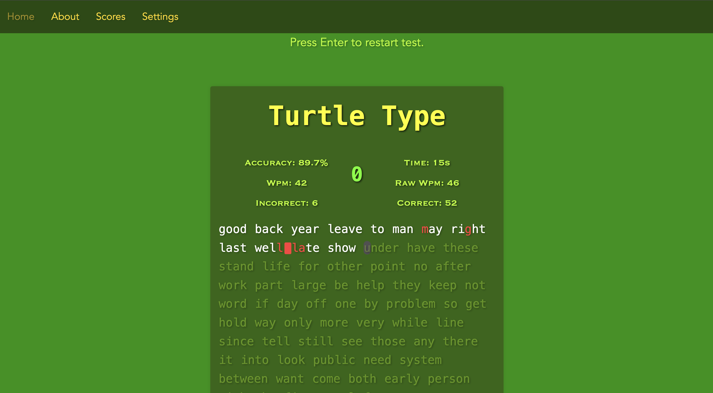
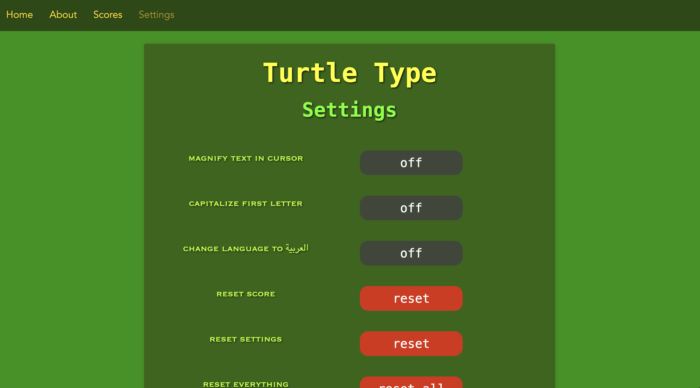
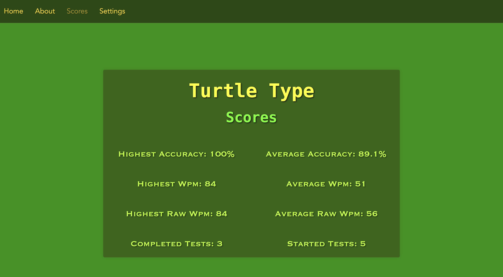

<div align="center">

# 🐢 Turtle Type

A typing speed test built from scratch. No frameworks, no backend, no dependencies.

[](https://codoxide.github.io/turtletype/)


</div>

---

## Live Demo

**[codoxide.github.io/turtletype](https://codoxide.github.io/turtletype/)**

## Preview

| Typing Test | Settings | Scores |
|---|---|---|
|  |  |  |

## Features

- **Live typing test** with a countdown timer, real time WPM, raw WPM, and accuracy
- **Score history**, saved locally in the browser: highest and average accuracy, WPM, and raw WPM, plus tests started versus completed
- **Settings**: cursor text magnification, auto capitalize, and an Arabic language mode, plus separate resets for score, settings, or everything
- **About page** explaining exactly how WPM, raw WPM, and accuracy are each calculated

## Pages

| File | What it does |
|---|---|
| `index.html` | The typing test itself |
| `Scores.html` | Highest and average stats across sessions |
| `Settings.html` | Display, language, and reset controls |
| `About.html` | How each stat is calculated |

## Tech

Vanilla JavaScript, HTML, and CSS. No frameworks, no build step, no external dependencies. All data lives in `localStorage`, nothing ever leaves the browser.

## Project Structure

```
turtletype/
├── index.html
├── About.html
├── Scores.html
├── Settings.html
├── css/
├── js/
└── images/
```

## Running Locally

```bash
git clone https://github.com/Codoxide/turtletype.git
cd turtletype
open index.html
```

No install step, no server needed.

---

<div align="center">
Built by Codoxide
</div>